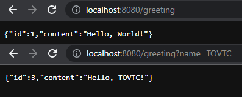

# Hello, User!

This Spring Boot REST API performs a simple GET request that accepts an optional name parameter and returns a greeting. 

## Table of Contents

* [Installation](#installation)
* [Built Using](#built)
* [Usage Information](#usage)
* [Authors & Acknowledgements](#credits)
* [Contact](#questions)

## Installation 
After cloning the repository, run the application and navigate to localhost:8080 to perform the request. To provide a name parameter, add "?name=YOURNAME" to the URL.

## Built Using 
* Java
* Spring Boot
* Spring Web

## Usage Information
This is a quick practice/demo application. 

  

## Authors & Acknowledgements

This application was written following the tutorial available [here](https://spring.io/guides/gs/rest-service/#scratch). 

Made by [TOVTC](https://github.com/TOVTC).

## Questions?
Contact repository author via [GitHub](https://github.com/TOVTC). 
    
